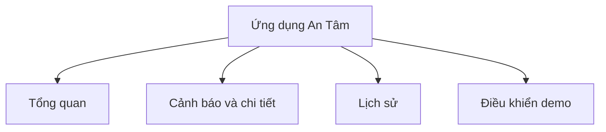
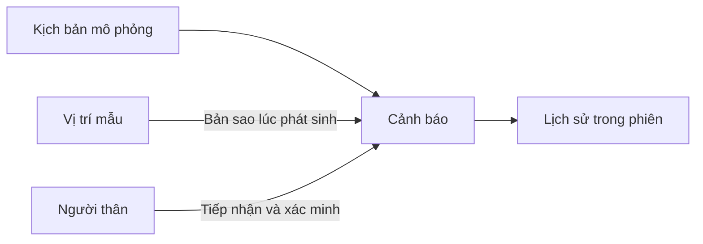

# An Tâm — ứng dụng mô phỏng chăm sóc người thân

Bản demo dành cho nhà đầu tư, dựa trên ý tưởng vòng tay hỗ trợ người cao tuổi. “An Tâm” là tên tạm. Màu xanh lam–xanh ngọc, nền trắng và thanh điều hướng bo góc tham khảo từ https://miraihealthcare.vn/. Không sử dụng logo, ảnh hoặc nội dung dịch vụ của Mirai Healthcare.

## Sử dụng

1. Chọn **Thử cảnh báo SOS** hoặc một tình huống trong **Điều khiển demo**.
2. Mở cảnh báo, chọn **Tôi tiếp nhận**.
3. Chọn **Liên hệ — mô phỏng** và kết quả liên hệ.
4. Nếu liên hệ được, chọn kết quả đã xác minh và lưu. Nếu chưa liên hệ được, sự kiện vẫn đang xử lý.
5. Xem **Lịch sử** hoặc **Đặt lại** để bắt đầu phiên mới.

Kịch bản bổ sung gồm nghi ngờ ngã, không ghi nhận chuyển động, mất kết nối và chưa có vị trí. Các kịch bản phát hiện chưa có ngưỡng hoặc thuật toán thực tế.

## Chạy trên máy

Ứng dụng là HTML, CSS và JavaScript chuẩn, không cần bước biên dịch hoặc thư viện chạy ứng dụng. Phục vụ thư mục `dist` bằng một máy chủ tĩnh, ví dụ `python -m http.server 4173 --directory dist`, rồi mở `http://localhost:4173`. Không mở trực tiếp tệp HTML bằng giao thức file vì ứng dụng dùng module JavaScript.

Chạy kiểm thử trạng thái bằng `node --test tests/state.test.js` với Node.js hiện đại. Font Be Vietnam Pro tải từ Google Fonts; khi không có mạng, giao diện dùng font dự phòng.

## Cấu trúc

## Quan hệ dữ liệu

Hai sơ đồ mô tả các thành phần đã triển khai và quan hệ dữ liệu, không biểu diễn số liệu đo lường.

## Kết quả kiểm tra

- Ba kiểm thử trạng thái đạt: luồng xử lý, bảo toàn vị trí sự kiện, mất kết nối, dữ liệu thiếu, đầu vào không hợp lệ, chống lặp và đặt lại.
- Kiểm thử tương tác bằng Edge đạt: SOS, chưa liên hệ được, ghi kết quả, ghi chú an toàn, nhiều cảnh báo, thay vị trí, thiếu vị trí, lịch sử, đặt lại và đóng hộp thoại trên điện thoại.
- Kiểm tra bề rộng 375, 768, 1024, 1440 và 1920 pixel: không cuộn ngang toàn trang. Không có lỗi JavaScript trong luồng kiểm thử.
- Đã xem ảnh máy tính và điện thoại; cảnh báo được đặt trước bản đồ trên điện thoại.
- Công cụ đo nhận nhầm các nhãn nằm trên bản đồ mô phỏng thành nhãn số đè lên biểu đồ. Các nhãn có nền trắng và là chú thích vị trí, không phải số liệu biểu đồ. Giữ cách hiển thị này sau khi xem ảnh.
- Giữ đường viền focus khi dùng bàn phím để người dùng biết vị trí đang thao tác.
- Có công cụ WebMCP khi trình duyệt hỗ trợ; đã kiểm tra hợp đồng đăng ký bằng môi trường giả lập. Chưa kiểm tra với trình duyệt hỗ trợ WebMCP gốc.

## Giới hạn

Mọi hồ sơ, vị trí, kết nối, cảnh báo và liên hệ đều được mô phỏng. Không có phần cứng, GPS, cuộc gọi, SMS hoặc thông báo thật. Dữ liệu chỉ tồn tại trong phiên; tải lại trang hoặc đặt lại sẽ xóa dữ liệu phiên.

Không có tài khoản ứng dụng, theo dõi người thật, doanh thu giả định, số liệu độ chính xác hoặc cam kết y tế. Quyền truy cập bản xuất bản do Sites quản lý; lần xuất bản đầu giữ riêng tư cho chủ sở hữu.
